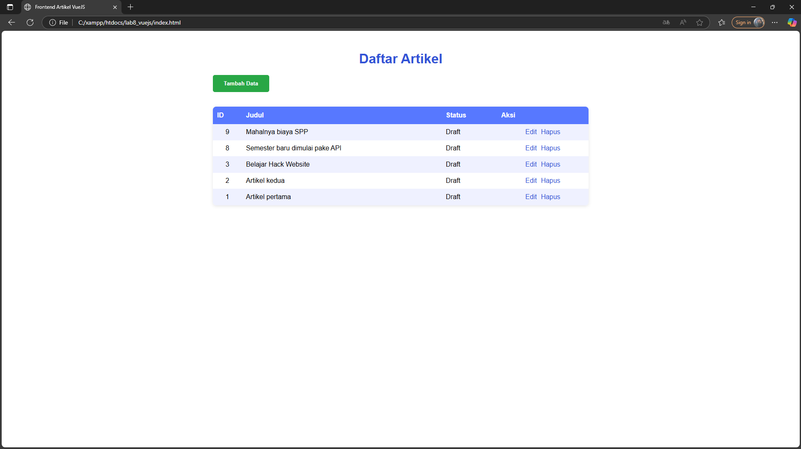
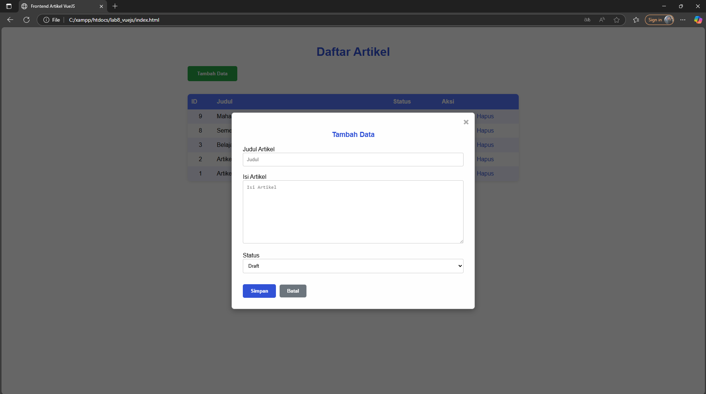
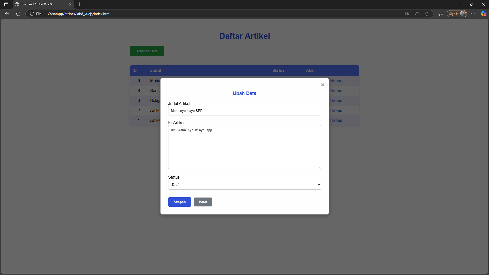

# 📘 Dokumentasi PRAKTIKUM 11 : VueJS

## 🙋‍♂️ Identitas  
- **Nama**: Indra Maha Resi  
- **NIM**: 312310044  
- **Kelas**: TI.23.C1  
- **Nama Project**: PRAKTIKUM WEB2  

---

## 📁 Deskripsi Singkat

Proyek ini dibuat untuk memenuhi tugas Praktikum Web2, khususnya berfokus pada pengembangan antarmuka frontend interaktif menggunakan **VueJS 3** yang terintegrasi dengan **API RESTful CodeIgniter 4** yang sudah ada (dari Praktikum 10).  
Ini mendemonstrasikan bagaimana aplikasi frontend terpisah dapat mengonsumsi data dan melakukan operasi **CRUD** melalui API.

---

## 📸 Dokumentasi Langkah-langkah

> Semua screenshot disimpan dalam folder `Dokumentasi/` di dalam proyek.

---

## 🧱 Praktikum 11: Frontend dengan VueJS 3

Praktikum ini mengimplementasikan antarmuka pengguna interaktif untuk manajemen artikel menggunakan **VueJS 3**, berinteraksi dengan **API RESTful CodeIgniter 4**.

### ✅ Langkah 1: Persiapan dan Struktur Proyek VueJS

Buat folder baru bernama `lab8_vuejs` di dalam docroot web server Anda (misalnya `htdocs`).

Struktur direktori:

lab8_vuejs/
├── index.html
├── assets/
│ ├── css/
│ │ └── style.css
│ └── js/
│ └── app.js

> Pastikan Anda memiliki akses internet untuk memuat CDN VueJS dan Axios.

---

### ✅ Langkah 2: Konfigurasi `index.html`

- Buat file `index.html` di dalam `lab8_vuejs/`.
- Sertakan CDN untuk **VueJS 3** dan **Axios** di bagian `<head>`.
- Link ke `assets/css/style.css` dan `assets/js/app.js`.
- Siapkan elemen `
` sebagai root aplikasi Vue.
- Tambahkan HTML untuk:
  - Tabel artikel
  - Tombol **Tambah Data**
  - Struktur modal form untuk tambah/ubah data

---

### ✅ Langkah 3: Styling dengan `style.css`

- Buat file `style.css` di `assets/css/`.
- Tambahkan kode CSS untuk mengatur:
  - Tampilan tabel
  - Form modal
  - Tombol
  - Responsivitas elemen lain

---

### ✅ Langkah 4: Logika Aplikasi dengan `app.js` (VueJS)

- Buat file `app.js` di `assets/js/`.
- Tentukan `apiUrl` yang menunjuk ke API CodeIgniter 4 kamu (dari Praktikum 10).
- Definisikan `data()` reactive:
  - artikel, formData, showForm, formTitle, statusOptions
- Implementasikan:
  - `mounted()` untuk memuat data pertama kali
  - `loadData()` – ambil data dari API via Axios
  - `statusText()` – ubah nilai status jadi teks
  - `tambah()` – buka modal untuk tambah data
  - `edit(data)` – isi form dengan data yang akan diubah
  - `hapus(index, id)` – request DELETE ke API dan update data
  - `saveData()` – request POST (tambah) atau PUT (ubah) ke API

---

### ✅ Langkah 5: Menguji Aplikasi Frontend VueJS

- Pastikan server CodeIgniter (lab7_php_ci) berjalan.
- Endpoint: `http://localhost:8080/post`
- Akses frontend VueJS:  
  `http://localhost/lab8_vuejs/index.html`

#### 💡 Uji Coba

- **Tambah Data**
  - Klik tombol "Tambah Data"
  - Isi form dan klik "Simpan"
  - Data baru muncul di tabel
- **Ubah Data**
  - Klik "Edit" di salah satu baris
  - Modal muncul, ubah data lalu simpan
- **Hapus Data**
  - Klik "Hapus", data langsung dihapus dari API

---

## 📷 Screenshot

| Tampilan             | Gambar                                  |
|----------------------|------------------------------------------|
| Tabel Data           |  |
| Form Tambah Data     |  |
| Form Ubah Data       |    |

---
